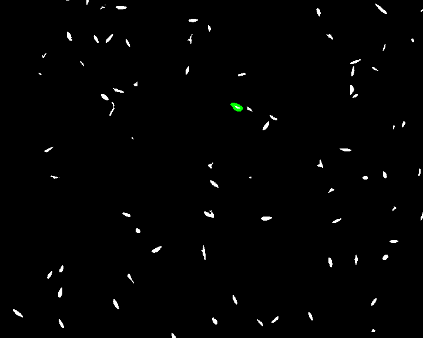

# Simple_Cell_Tracking_Starter
Some foundational code for tailoring your own cell tracking implementation

Ages ago, I worked with a friend on some deep-learning based floodfill software for cell tracking.  

Indeed, you'll find a lot of papers out there employing UNET and a whole plethora of sophisticated tools for segmentation and tracking.

Recently, though, it occurred to me that if I were a grad student / post-doc new to machine vision, so many of those tools wouldn't be much help to me.  Every setup is different and I'd probably have resigned myself to some manual labor already.  A trained UNET classifier is cool, but what am I going to do with it?  Retrain it on my own dataset?  Maybe that's the answer, but it seems like a lot of effort for uncertain returns.  I mean, it's not self evident how well the classifier will generalize.  Even if it does, since I'm personally responsible for my data, I'm probably going to have to manually inspect the results anyway, so in some ways I don't really *want* a lot of automation.

What I'd really need are just some simple starter tools to get the data to a point where I could finish off marking things manually myself, i.e., basically a simple introductory pipeline showing what can be done with thresholding, contour matching, watermarking, etc.

That's all this repo is.

Here's an example applied to the PhC-C2DL-PSC_splitting dataset from the <a href="http://celltrackingchallenge.net/">cell tracking challenge</a>.  

All this does is take the tresholded data, an initiially identified cell, and then contour matches / watersheds its way through the data to find children and distingusih neighbors respectively.

I stopped developing before getting too fancy, since the whole point is you'll need to tailor to your microscopy setup, cell behavior, etc.  But next steps may be, e.g., to incorproate the frame-by-frame difference to improve the watershedding.
